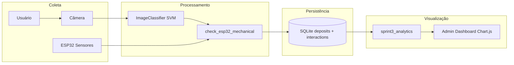

# Fluxo de Dados — TOTEM IA (Sprint 3)

Documentação técnica do pipeline **sensor → banco → análise → visualização**.

---

## Visão Geral

O sistema integra quatro etapas em um único fluxo funcional:

1. **Coleta** — Câmera e sensores ESP32
2. **Processamento** — Classificação SVM + validação mecânica
3. **Persistência** — Banco SQLite (deposits + interactions)
4. **Visualização** — Dashboard admin com Chart.js

---

## Diagrama do Fluxo



---

## Detalhamento por Etapa

### 1. Coleta

| Fonte | Descrição | Endpoint/Origem |
|-------|-----------|-----------------|
| **Câmera** | Imagem da tampinha (base64 ou file upload) | `POST /api/validate-complete` |
| **ESP32** | Sensores de presença, peso (g), temperatura | `GET /api/sensors` via `get_esp32_sensors()` |

- Validação de peso: `PESO_MIN_TAMPINHA` (2400g) ≤ peso ≤ `PESO_MAX_TAMPINHA` (2800g)
- Fallback quando ESP32 offline: `presenca=True`, `peso=2600`, `temperatura=25`

### 2. Processamento

| Etapa | Módulo | Descrição |
|-------|--------|-----------|
| Classificação | `src/modules/image.py` | SVM 8+HOG (332 features), pré-filtros CV (circularidade, Hough) |
| Validação mecânica | `src/hardware/esp32.py` | `check_esp32_mechanical(presenca, peso)` |
| Impacto ambiental | `src/hardware/esp32.py` | `calculate_environmental_impact()` → `plastico_reciclado_g` |

- Se classificação = não-tampinha → rejeita imediatamente (sem persistir)
- Se tampinha → prossegue para ESP32 e BD em thread background

### 3. Persistência

| Tabela | Campos principais |
|--------|-------------------|
| **deposits** | `id`, `timestamp`, `ml_confidence`, `presence_detected`, `weight_value`, `weight_ok`, `plastico_reciclado_g` |
| **interactions** | `id`, `deposit_id` (FK), `timestamp`, `resultado` (sucesso/erro_classificacao/erro_mecanica/rejeitado) |

- Queries parametrizadas (`?`)
- Context manager: `with db_connection as db:`

### 4. Visualização

| Componente | Descrição |
|------------|-----------|
| **Dashboard** | `GET /api/admin/dashboard` → `templates/admin_dashboard.html` |
| **Analytics** | `build_analytics_report()`, `build_daily_trend()` em `src/modules/sprint3_analytics.py` |
| **Gráficos** | Chart.js: doughnut (aceitas/rejeitadas), line (tendência 7 dias) |
| **KPIs** | Total interações, taxa de aceite, rejeitadas, impacto (kg reciclado) |

---

## Endpoint Principal: validate-complete

```
POST /api/validate-complete
  Input: multipart (file) ou JSON (image base64)
  
  Fluxo:
  1. Decodificar imagem
  2. ImageClassifier.classify_image() → (pred, conf, sat, method)
  3. Se pred != 1 → retorna rejeitado (200)
  4. Se pred == 1 → retorna sucesso (200) e inicia thread background:
     a. get_esp32_sensors()
     b. check_esp32_mechanical(presenca, peso)
     c. confirm_esp32_detection('tampinha', conf)
     d. calculate_environmental_impact() → plastico_reciclado_g
     e. save_deposit_data(conf, presenca, weight_ok, peso, plastico_reciclado_g)
     f. save_interaction(SUCESSO, deposit_id)
```

---

## Decisões Técnicas

- **Thread background para ESP32**: Resposta imediata ao usuário; validação mecânica não bloqueia
- **Fallback ESP32 offline**: Sistema continua operando com valores simulados
- **weight_ok**: Validado com `PESO_MIN`/`PESO_MAX` antes de salvar
- **plastico_reciclado_g**: Obtido de `calculate_environmental_impact()` (0.5g por tampinha)

---

*Documento gerado para Sprint 3 — Integração Funcional e Analytics*
